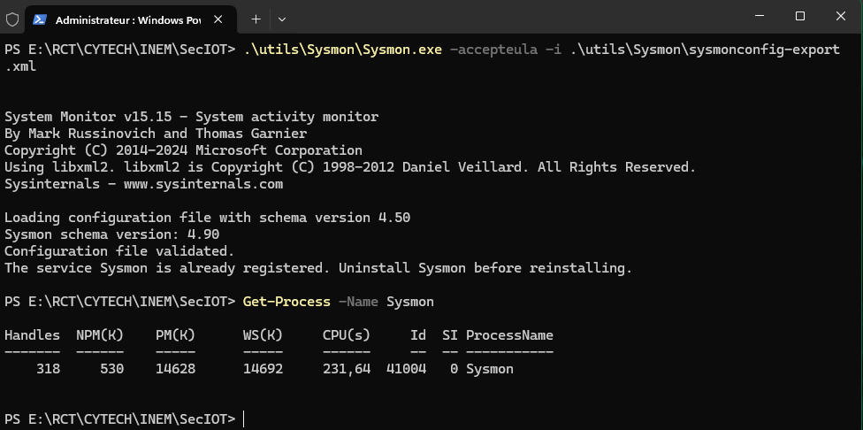
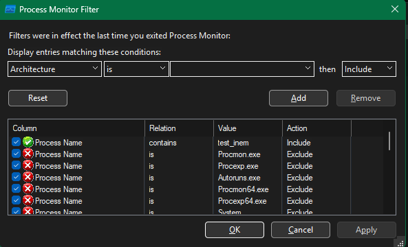
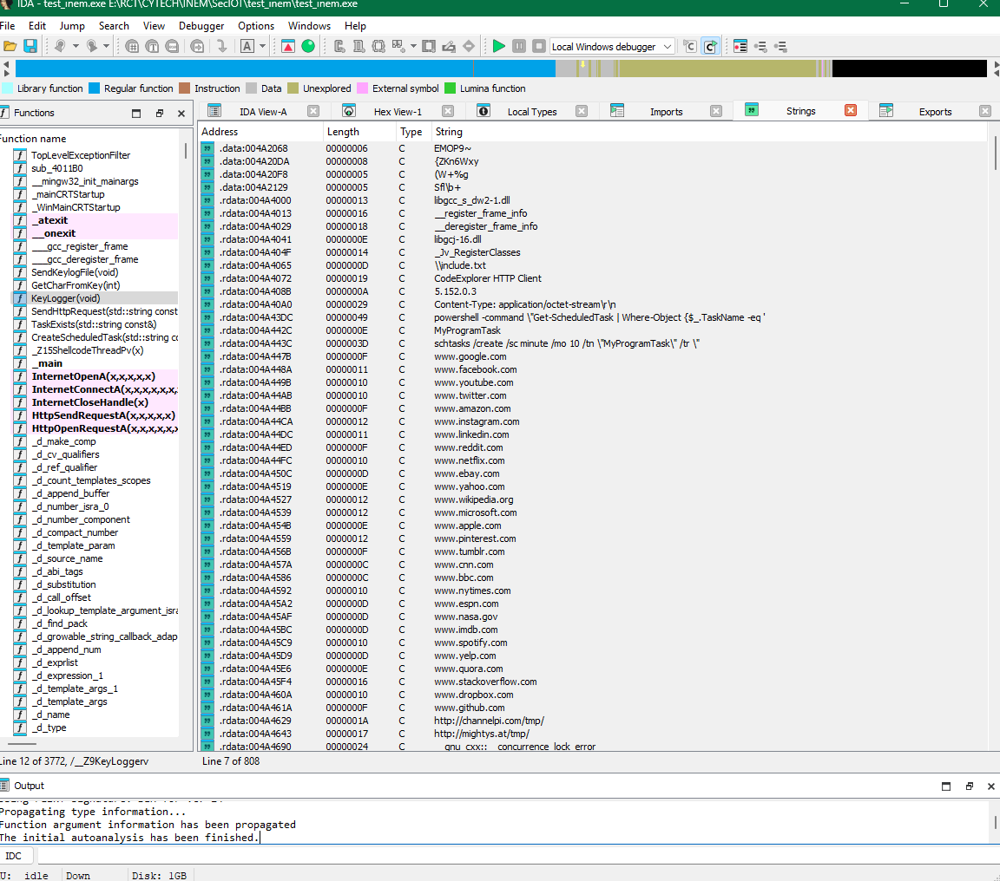
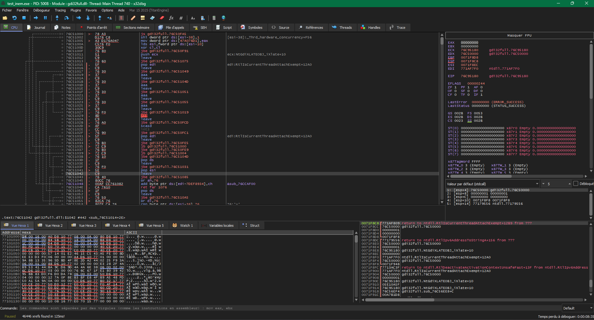
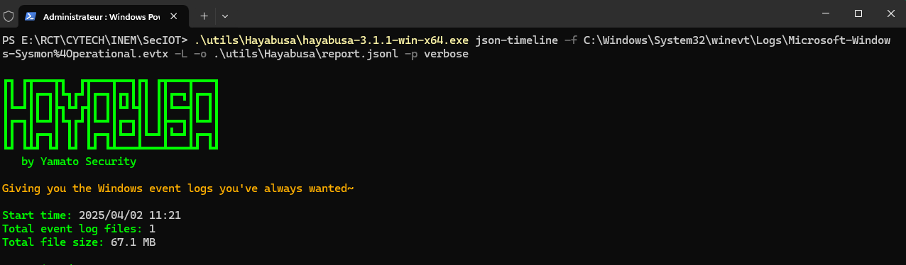
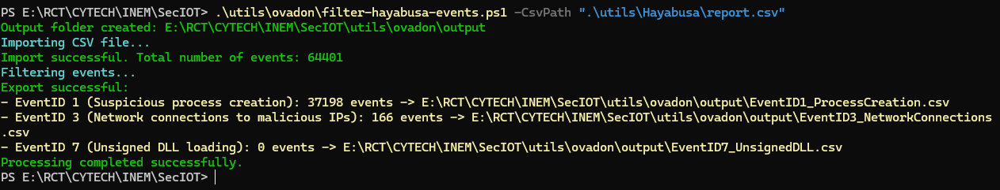
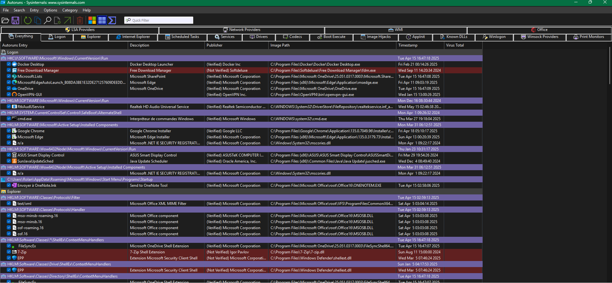

# SECURITE DES OBJETS CONNECTES : Guide d'Analyse de SécuritéGuide d'Analyse de Sécurité

## 📞 Contact et ressources

[](https://www.linkedin.com/in/rct/)
[](https://github.com/rolln7drktayau/)

## Préface

Ce guide présente la méthodologie d'analyse de sécurité utilisée dans le cadre du cours SecIOT. Il suit un workflow structuré pour détecter et analyser les menaces potentielles.

Toutes les commandes effectuées sont propres à mon répertoire.

## Arborescence du projet

```Powershell
SECIOT
├── archives
├── assets
│   ├── Autoruns
│   ├── hayabusa
│   ├── IDA
│   ├── procmon
│   ├── symon
│   └── x32dbg
├── logs
├── output
├── rules
├── saves
├── test_mem
└── utils
    ├── Autoruns
    ├── Hayabusa
    ├── IDA
    ├── ovadon
    ├── ProcessMonitor
    ├── Sysmon
    ├── Takajo
    ├── x64dbg
└── utilsreadme.md
```

## Table des matières

1. [Configuration de la surveillance système](#1-configuration-de-la-surveillance-système)
2. [Analyse en temps réel](#2-analyse-en-temps-réel)
3. [Analyse des binaires suspects](#3-analyse-des-binaires-suspects)
4. [Analyse des logs système](#4-analyse-des-logs-système)
5. [Filtrage et visualisation des résultats](#5-filtrage-et-visualisation-des-résultats)
6. [Vérification des mécanismes de persistance](#6-vérification-des-mécanismes-de-persistance)
7. [Analyse automatisée](#7-analyse-automatisée)

## 1. Configuration de la surveillance système

### Installation et configuration de Sysmon

Sysmon (System Monitor) est un service Windows qui enregistre l'activité système dans les journaux d'événements pour une analyse ultérieure.

```powershell
# Exécuter sysmon avec une configuration personnalisée
.\utils\Sysmon\Sysmon.exe -accepteula -i .\utils\Sysmon\sysmonconfig-export.xml

# Vérifier que sysmon est en cours d'exécution
Get-Process -Name Sysmon
```

#### Sortie de la ligne de commande



## 2. Analyse en temps réel

### Utilisation de Process Monitor

Process Monitor permet de surveiller en temps réel l'activité du système, notamment les accès au registre, au système de fichiers, au réseau et les processus.

``` powershell
.\utils\ProcessMonitor\Procmon.exe
```

*Capture d'écran: Interface de Process Monitor en action [Insérer capture d'écran ici]*

Conseils d'utilisation de Procmon:

- Utilisez les filtres pour réduire le bruit
- Concentrez-vous sur les processus suspects
- Recherchez les accès inhabituels aux fichiers système ou au registre

#### Ouvrir Procmon et configurer les filtres pour suivre

- `Process Name` = nom du fichier malveillant.
- `Operation` = `WriteFile`, `RegCreateKey`, `RegSetValue`, `TCP/UDP Connect`.

#### Exécuter la charge et observer

- Fichiers créés/modifiés (ex. fichiers .dll, .exe, scripts).
- Clés de registre modifiées (ex. `Run`, `Services` pour la persistance).
- Connexions réseau suspectes (IP/domaines inconnus).

#### Sorties

- Application du filtre sur test_inem.exe


<!--  -->

- Affichage de l'historique d'activités capturées dans Procmon


#### Analyse

| **Catégorie** | **Opérations/Commandes** | **Détails** |
|---------------|--------------------------|-------------|
| **Démarrage du processus** | `Process Start` | PID : 13152, Parent PID : 41972. Exécuté depuis `E:\RCT\CYTECH\INEM\SecIOT\test_inem\test_inem.exe`. Variables d'environnement et répertoire de travail chargés. |
| **Gestion des threads** | `Thread Create` | Création de threads (IDs : 51876, 36940, 12620, 62392, 61692, 3756). |
| **Chargement de DLLs** | `Load Image` | Chargement de bibliothèques système : `ntdll.dll`, `kernel32.dll`, `KernelBase.dll`, `shell32.dll`, `advapi32.dll`, `combase.dll`, `SHCore.dll`, etc. |
| **Opérations sur le registre** | `RegOpenKey`, `RegQueryValue`, `RegSetValue`, `RegCloseKey` | Interactions avec les clés :<br>- **HKLM\System\CurrentControlSet\Control\Nls\CodePage** (ACP/OEMCP).<br>- **HKLM\System\CurrentControlSet\Control\Session Manager** (SafeDllSearchMode).<br>- **HKCU\Control Panel\Desktop** (paramètres d'interface). |
| **Accès aux fichiers** | `CreateFile`, `ReadFile`, `QueryStandardInformationFile`, `CloseFile` | Lecture/écriture dans :<br>- **Prefetch** (`C:\Windows\Prefetch\TEST_INEM.EXE-E388061B.pf`).<br>- **DLLs système** (`C:\Windows\SysWOW64\*.dll`).<br>- **Répertoire courant** (`E:\RCT\CYTECH\INEM\SecIOT\test_inem`). |
| **Gestion des services** | `RegOpenKey`, `RegQueryValue` | Accès aux services système :<br>- **BAM** (Background Activity Moderator) pour mettre à jour les horodatages.<br>- **Terminal Server** (vérification des paramètres de session). |
| **Sécurité** | `QuerySecurityFile`, `RegOpenKey` | Vérification des permissions (ACL) et accès aux stratégies :<br>- **AppCompatFlags** (compatibilité des applications).<br>- **SafeBoot** (mode sans échec). |
| **Configuration système** | `RegQueryValue`, `RegOpenKey` | Lecture des paramètres :<br>- **CodePage** (encodages).<br>- **MUI/UILanguages** (langues d'interface).<br>- **FileSystem** (LongPathsEnabled). |
| **Réseau et RPC** | `Load Image`, `RegOpenKey`, `RegQueryValue` | Utilisation de DLLs réseau (`srvcli.dll`, `netutils.dll`) et configuration RPC (Remote Procedure Call). |
| **Gestion des préférences** | `RegOpenKey`, `RegQueryValue` | Accès aux dossiers utilisateur :<br>- **Shell Folders** (Cache, Profil).<br>- **Explorer\FolderDescriptions** (chemins système). |
| **Interactions avec Conhost** | `Process Create` | Lancement de **conhost.exe** (PID : 32788) pour la console Windows. |
| **Gestion des ressources** | `Process Profiling` | Surveillance des ressources :<br>- **Private Bytes** : 471 040, **Working Set** : 2 781 184.<br>- Temps CPU (User/Kernel) : 0 seconde. |

## 3. Analyse des binaires suspects

### Analyse statique avec IDA Pro

IDA Pro est un désassembleur interactif utilisé pour l'analyse statique de code binaire.

```Powershell
.\utils\IDA\ida.exe
```

- Lancer IDA free


- Appliquer des filtres pour afficher les fonctions et les variables


### Analyse dynamique avec x64dbg

x64dbg permet d'analyser le comportement des programmes pendant leur exécution.

```Powershell
.\utils\x64dbg\release\x32\x32dbg.exe
```

- Exécution via x32dbg


## 4. Analyse des logs système

### Analyse des logs Sysmon avec Hayabusa

Hayabusa est un outil d'analyse des journaux d'événements Windows basé sur les règles SIGMA.

#### Génération d'un rapport JSON à partir des logs Sysmon*

```Powershell
.\utils\Hayabusa\hayabusa-3.1.1-win-x64.exe json-timeline -f C:\Windows\System32\winevt\Logs\Microsoft-Windows-Sysmon%4Operational.evtx -L -o .\utils\Hayabusa\report.jsonl -p verbose
```



#### Génération d'un rapport CSV à partir des logs Sysmon

```Powershell
.\utils\Hayabusa\hayabusa-3.1.1-win-x64.exe csv-timeline -f C:\Windows\System32\winevt\Logs\Microsoft-Windows-Sysmon%4Operational.evtx -o .\utils\Hayabusa\report.csv -p verbose -r \utils\Hayabusa\rules
```

### Analyse de tous les logs Windows

Pour une analyse plus complète, vous pouvez analyser tous les logs Windows:

```Powershell
.\utils\Hayabusa\hayabusa-3.1.1-win-x64.exe json-timeline -d C:\Windows\System32\winevt\Logs\ -L -o .\utils\Hayabusa\report.jsonl -p verbose
```

```Powershell
.\utils\Hayabusa\hayabusa-3.1.1-win-x64.exe csv-timeline --no-wizard -d C:\Windows\System32\winevt\Logs\ -o .\utils\Hayabusa\report.csv
```

## 5. Filtrage et visualisation des résultats

### Filtrage personnalisé des résultats

```Powershell
.\utils\ovadon\filter-hayabusa-events.ps1 -CsvPath ".\utils\Hayabusa\report.csv"
```

Ce script PowerShell filtre les événements dans le rapport CSV généré par Hayabusa selon des critères personnalisés.



- EventID 1 : Création de fichier suspects
- EventID 3 : Connexions réseau suspectes aux IP malicieux
- EventID 7 : Chargement de DLLs malveillantes

### Visualisation avec Takajo

Takajo est une interface web pour visualiser et analyser les résultats générés par Hayabusa.

```Powershell
.\utils\Takajo\takajo.exe -f .\utils\Hayabusa\report.jsonl
```

## 6. Vérification des mécanismes de persistance

### Analyse avec Autoruns

Autoruns permet d'identifier les programmes configurés pour démarrer automatiquement, ce qui est utile pour détecter les mécanismes de persistance malveillants.

```Powershell
.\utils\Autoruns\Autoruns.exe
```

*Capture d'écran: Interface d'Autoruns montrant les points de persistance


Points à vérifier:

- Entrées de registre inhabituelles
- Tâches planifiées suspectes
- Services système non reconnus
- DLL chargées au démarrage

## 7. Analyse automatisée

### Soumission à VirusTotal

VirusTotal est un service en ligne qui analyse les fichiers suspects avec plusieurs moteurs antivirus.

```Powershell
.\utils\vt-cli\vt.exe scan file .\chemin\vers\fichier_suspect
```

*Pas utilisé pour ce cas, mais utile pour les fichiers suspects*

### Autres plateformes d'analyse

- **Joe Sandbox**: Plateforme d'analyse automatisée de malwares qui exécute les fichiers dans un environnement isolé.
- **VM Ray**: Solution d'analyse automatisée de malwares qui fournit des rapports détaillés sur le comportement des fichiers malveillants.

*Capture d'écran: Résultats d'analyse de Joe Sandbox ou VM Ray [Insérer capture d'écran ici]*

## 8. Rapport final

### Rapport d'Analyse de Malware Keylogger

| Fonctionnalité | Description |
|----------------|-------------|
| **Keylogging** | - La fonction `KeyLogger` enregistre les frappes clavier dans un fichier `include.txt` situé dans le dossier de l'utilisateur (`SHGetFolderPathA` avec `CSIDL_PROFILE`)<br>- Utilise `GetAsyncKeyState` pour détecter les touches pressées et les convertit en caractères via `GetCharFromKey` |
| **Exfiltration des données** | - `SendKeylogFile` envoie périodiquement le fichier `include.txt` via HTTP POST à l'adresse IP `5.152.0.3:80`, masqué sous des en-têtes légitimes |
| **Persistance** | - `CreateScheduledTask` crée une tâche planifiée avec `schtasks /create` pour relancer le malware toutes les 10 minutes |
| **Communication réseau** | - Contacte une liste de domaines (Google, Facebook, GitHub, etc.) pour masquer son trafic ou tenter une propagation<br>- Envoie des requêtes HTTP à des URLs suspectes comme `http://channelpi.com/tmp/` |
| **Injection de shellcode** | - `ShellcodeThread` exécute un shellcode stocké en mémoire (`_shellcode`), potentiellement pour des actions malveillantes avancées |
| **Détection d'environnement** | - Vérifie la présence de certaines tâches planifiées pour éviter les doubles exécutions |
| **Techniques anti-analyse** | - Manipulation de chaînes via des opérations complexes sur `std::string`<br>- Utilisation de threads séparés pour le keylogging et l'exfiltration<br>- Désactivation possible des exceptions via `SetUnhandledExceptionFilter` |

### En définitive

Ce malware combine la collecte discrète de données, la persistance système, la communication camouflée et l'exécution de code arbitraire, typique des outils d'accès à distance (RAT) ou des stealers.

## Conclusion

Ce workflow d'analyse permet une approche méthodique pour détecter et analyser les menaces potentielles. En combinant l'analyse en temps réel, l'analyse des logs et l'examen des binaires suspects, il est possible d'obtenir une vision complète de l'activité malveillante potentielle sur un système.

## Ressources supplémentaires

- Documentation officielle de Sysmon
- Documentation de Hayabusa
- Règles SIGMA
- Guide d'analyse de malware
